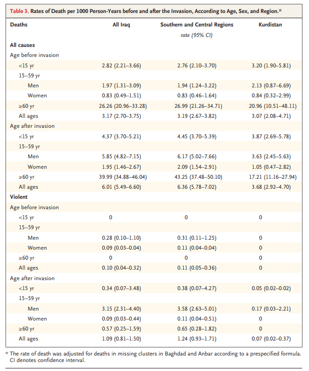

# Case Study: Violence-Related Mortality in Iraq from 2002 to 2006

## What epistemic uncertainties are there?

### Objects of uncertainty

Estimates of death toll in Iraq from the time of U.S. invasion in March 2003 until June 2006.

### Sources of uncertainty

Due to lack of reliable death-registration systems previous death tolls have relied on household surveys which are subject to bias. More specifically, these surveys reference a mid-2006 national survey of a sample of population clusters and The Iraq Body Count project, which is based on a continuous count of screened and validated press reports of casualties from March 2003 to June 2006. This bias is often due to difficulty of data collection from conflict zones, where sampling is often restricted to small areas, leading to many under-sampled areas.

To attempt to better estimate Violence-Related Mortality, this paper uses a another source of data, the Iraq Family Health Survey, conducted by federal/regional ministries in Iraq in collaboration with the World Health Organization.

### Levels of uncertainty

For direct uncertainty in this report, we would be concerned about the 95% confidence interval range that is presented.

For indirect uncertainty in the report discusses missing household clusters (as only 9,345 of the originally targeted 10,080 households were surveyed) and underreporting due to the probability of household dissolution. Both of these are acknowledged and authors made attempts to account for them in the report.

## In what form are the uncertainties communicated?

### Expressions and formats of uncertainty

The paper delves into meta-information about its results via tables of numerical data, categorized by region, number of households selected/visited, households that were vacant/absent/destroyed/denied/etc., along with accompanying information about reporting bias, sibling data, response rates, and statistical analysis. This provides very thorough insight into the indirect uncertainty.

Next, the actual estimates of violence-related mortality are also presented in the form of a numerical table partitioned by demographic, disease, and injury data. This is then further stratified into all causes of mortality, specifically violent causes of mortality, and region. The paper openly displays its 95% confidence intervals in the tables of data as shown below.

The methodology is even further laid out under the "Methods - Statistical Analysis" section, in which they use the jackknife procedure, Monte Carlo simulations, estimations of sampling errors, missing samples uncertainty, and projected population numbers. Importantly, the authors also clearly state any assumptions they made, e.g., the level of underreporting, the assumption of a normal distribution in post-invasion migration, and the assumption of a normal distribution in the excess risk of mortality in missing clusters in Baghdad/Anbar.

Finally, although the Iraq Family Health Survey counted a significantly higher total death toll than the Iraq Body Count project, the authors acknowledge that if the pre-invasion rates of adult mortality (total, not just violent) were used as a baseline, the IFHS death toll could be underreported by as much as 55% for men and 70% for women.

## What are the psychological effects of uncertainty communication?

The psychological effects of uncertainty in death tolls range quite widely. On the emotional front, this includes things such as anxiety over the survival of a loved one and uncertainty in a failing bureaucracy. On the other side is the uncertainty of lawmakers and leaders regarding which policies to implement when the state of their populace is not known or fuzzy. Another real-world example of this is when Andrew Cuomo (the governor of New York State) covered up deaths in nursing homes during COVID, leading policymakers to not act in time to save a portion of the populace.

For transparency, the above psychological effects are those that I am aware of. The paper itself was incredibly neutral, focusing on the uncertainties of the survey and calculations without injecting personal discourse.

## Conclusions

When taking this entire paper into account, the statistics appear trustworthy due to the meticulous manner in which the authors documented and addressed all sources of uncertainty, both direct and indirect. Parameters such as biases, assumptions made, and why they were made, as well as openly presenting the 95% interval instead of giving a point estimate, were all openly documented. I believe this paper's comprehensive approach fulfills best practices for sensitive and important topics like mortality while maintaining extreme objectivity due to its political nature.