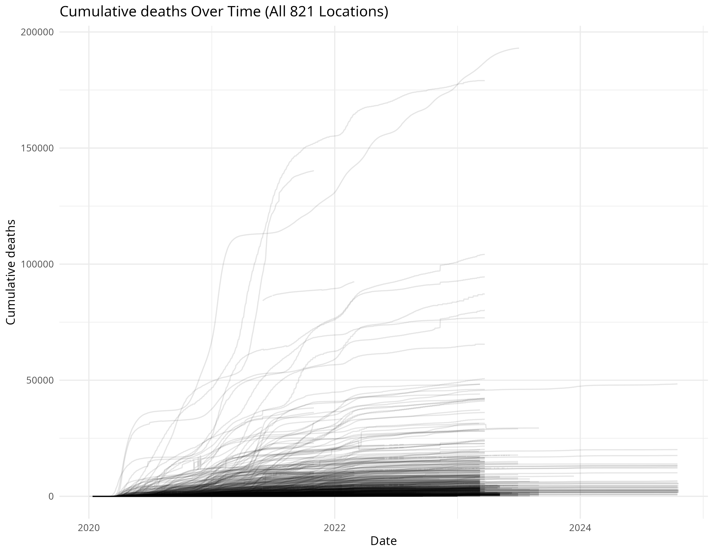
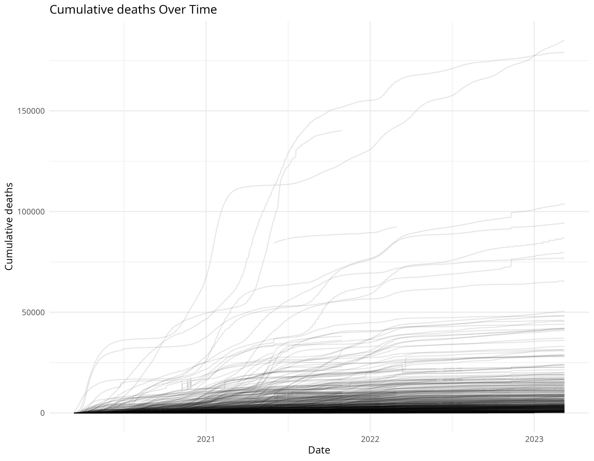
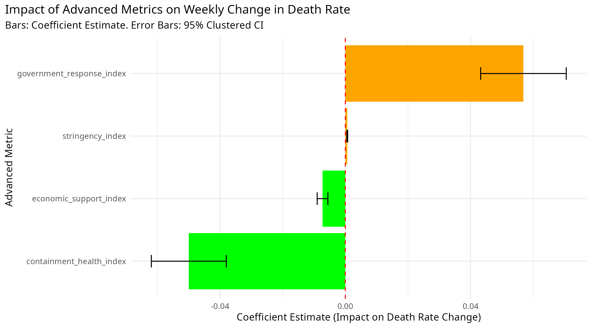

# The Impact of Government Intervention on COVID19 Deaths

## Introduction

The global spread of COVID-19 required immediate large scale government interventions, ranging from mandatory mask use to large-scale lockdowns. While these Non-Pharmaceutical Interventions (NPIs) successfully curbed transmission, they imposed massive social and economic costs. This report attempts to addresses a critical policy question: Which specific government policies had the greatest, most certain impact on reducing COVID-19 mortality?

This also poses a problem as using categorical values and trying to relate it to changing death count inherits quite a lot of uncertainty from things such as: local governance effectiveness, population compliance, and inherent health system resilience. All of which have strong effects of mortality outcomes. There is additional measurement uncertainty, when metrics are inferred or inherited from higher geographical levels, introducing noise that can skew coefficient estimates.

This report attempts to utilize granular sub-national policy and mortality data within a Fixed Effects (FE) Regression Model. The FE model controls for all time-invariant unobserved differences across locations. Importantly, we introduce a control variable derived from the original data's structure in an attempt to explicitly quantify and control for this measurement uncertainty.

We first analyze four aggregated policy indices (Advanced Metrics) and then conduct a granular comparison of fourteen individual policy levers. The results provide a best attempt at bias-corrected coefficient estimates, offering possible evidence to guide targeted, informed policy responses in future pandemics of a similar nature.

## Data Cleaning

The data for this analysis is a panel dataset made up of The Oxford COVID-19 Government Response Tracker (OxCGRT), providing daily policy metrics, and World Bank Open Data, Johns Hopkins CSSE, and Our World in Data, providing daily cumulative death counts. The final unit of observation is a daily time series for each unique state-level administrative region (`administrative_area_level_2`).

### Data Quality and Filtering

The integrity of the panel data was required for the Fixed Effects model's validity. Missingness was managed through two sequential processes:

1.  **Strict Data Comparability Filter:** To ensure that the estimated impacts of the 18 policy variables (4 Advanced Metrics and 14 Individual Policies) are directly comparable, a strict filtering rule was implemented: any location ID that contained 50% or more missing values (NA) in *any single policy column* or the cumulative death count contained 30% or more missing values (NA). This sacrifice of sample size prioritizes data quality and result comparability.

2.  **Policy Imputation and Inferred Data Handling:** Missing values were handled based on their position in the time series:

    -   **Initial Gaps (Pre-Policy):** Missing values at the start of a location's time series (before the first recorded policy) were imputed with a policy level of 0 (no measures). This corrects the bias introduced by assuming a partial policy was in place before the pandemic began.

    -   **Mid-Series Gaps (Policy Lulls):** Missing values occurring between two valid policy observations were imputed using Last Observation Carried Forward (LOCF). This assumes that a policy in effect remained in effect until a change was officially recorded.

3.  **Uncertainty Quantification (Sign Flipping):** The original OxCGRT data used negative signs to denote metrics that were inherited from a higher geographical level or inferred entirely. We handled this critical measurement uncertainty by:

    -   **Flipping the Sign:** Converting all policy values to their absolute value to create the usable, positive policy metric.

    -   **Creating Uncertainty Controls:** Simultaneously creating 18 distinct **`[Policy]_Inferred_Count`** variables for each location ID. These static variables record the total number of days a specific policy's value was inferred, serving as a direct control for location-level data quality in the regression models.

Finally, for a quick sanity check, I just plotted all the death counts as a line graph which highlighted something I had previously missed. The data gets much sparser in the middle, with many counts cutting of before others. A quick check for the median start and end date as well as a quick visit to the CDC website[1] ([covid timeline museum](https://www.cdc.gov/museum/timeline/covid19.html) accessed December 9, 2025) told me that the World Health Organization declared an end to the public health emergency in May 2023. This is likely the reason why many locations in the dataframe are missing further data beyond March 2023 as the pandemic had already wound down before the official declaration by the WHO.

| Before Trimming | After Trimming |
|----|----|
| {width="300"} | {width="300"} |

Now, with all this done, the dataset had been cleaned and trimmed down to 630 locations, roughly \~600k observations, and policy data gaps zeroed or imputed.

## Feature Engineering

To ensure the time series analysis met the assumptions of linear regression, the raw data was transformed into stationary, time-lagged features. The transformation process addressed the oscillating nature of the pandemic (non-stationarity), the delay between policy implementation and mortality outcome, and noise from daily cumulative counts.

### Construction of the Dependent Variable ($Y$)

The dependent variable, $\mathbf{Y}$, must reflect the policy's impact on the severity of the pandemic wave, not just coincidental flucuations with the time series's trends.

1.  **Normalization:** Daily death counts were converted to a 7-day rolling average per 100,000 population, creating $Y_{\text{Rate}}$.

2.  **Achieving Stationarity:** The final dependent variable is the $\mathbf{Y_{Weekly\_Change\_Deaths}}$, calculated as the difference between the current $Y_{\text{Rate}}$ and the $Y_{\text{Rate}}$ from the previous week. This first-difference transformation removes the time-dependent trend, allowing the Fixed Effects model to test if the policy caused the death rate to accelerate or decelerate faster than the existing momentum.

### Construction of the Policy Predictors ($X$)

All 18 policy columns were transformed to create the final predictors, $\mathbf{X_{Lagged\_Smoothed}}$:

1.  **Smoothing:** All policy columns were first processed using a 7-day rolling mean. This smooths out reporting irregularities (weird cumulative differences was cautioned in the documentation) to give the policy change it's best chance to reflect a sustained change in intervention effort, rather than a single-day fluctuation.

2.  **Lagging:** The smoothed policy value was then shifted backward by 21 days. This 21-day lag accounts for the established epidemiological latency between the implementation of an intervention (e.g., a lockdown) and the resulting change in the observed mortality figures. [This is something that affect policies of all kinds: environmental, monetary, COVID, etc.] (I do not believe this commonly counts as general knowledge hence, [Policy Lag [7]](https://www.sciencedirect.com/science/article/pii/S0965856421000276), accessed December 9, 2025)

### Autocorrelation Control

The model includes a critical control variable, $\mathbf{Y_{Lagged\_Control}}$, which is the $\mathbf{Y_{Weekly\_Change\_Deaths}}$ from seven days prior. This term accounts for short-term autocorrelation, preventing the policy coefficients from capturing the underlying momentum of the epidemic curve. \*We just want everything to be focused on "does a policy mean more or less deaths" and isolate everything else.

## Implementation

The analysis utilized the **`felm`** function from the **`lfe`** package in R, which is optimized for high-dimensional fixed effects estimation in large datasets. The Fixed Effects model structure is fits the use case for inference in this context.

### Model Specification

**Disclaimer**: I'm not completely confident on my understanding even after doing reading. References [4-6] provides possibly more accurate information than the following.

The core idea is a **two-way fixed effects model** clustered by `id`. The general formula for both comparative models is:

$$
\mathbf{Y_{it}} \sim \sum_{j=1}^{N} \beta_j X_{j, it-21} + \gamma Y_{it-7} + \sum_{k=1}^{N} \delta_k U_{k, i} \mid \mu_i + \epsilon_{it}
$$

Where:

-   $Y_{it}$ is the $Y_{Weekly\_Change\_Deaths}$ for location $i$ at time $t$.

-   $X_{j, it-21}$ is the $j$-th policy (lagged and smoothed).

-   $Y_{it-7}$ is the lagged dependent variable control.

-   $U_{k, i}$ is the $k$-th policy's **Inferred Count** (the uncertainty control, which is time-invariant for each location $i$).

-   $\mu_i$ is the **Location Fixed Effect** (controlling for all time-invariant unobserved characteristics).

### The Comparison Models

We ran two separate `felm` regressions to isolate and compare the two sets of policy variables:

1.  **Model 1: Advanced Metrics Comparison:** This model included the four aggregated policy indices as the primary predictors: `stringency_index`, `containment_health_index`, `economic_support_index`, and `government_response_index`. All four corresponding `_Inferred_Count` variables were included as controls to address metric-specific data quality.

2.  **Model 2: Individual Policies Comparison:** This model included the fourteen granular policy indicators ($P1$ through $P14$) as the primary predictors. All fourteen corresponding `_Inferred_Count` variables were included as controls.

### Statistical Inference

All hypothesis tests were conducted using clustered standard errors at the `id` level. This correction is essential because standard errors must account for the dependence of observations over time within the same location, ensuring that the calculated p-values and confidence intervals for the policy coefficients are valid.

## Results

{width="500"}

| Metric                    | p-value  |
|---------------------------|----------|
| stringency_index          | 3.61e-16 |
| containment_health_index  | 2.65e-16 |
| economic_support_index    | \<2e-16  |
| government_response_index | 3.5e-16  |

{width="500"}

| Policy                              | p-value  |
|-------------------------------------|----------|
| school_closing                      | 0.117627 |
| workplace_closing                   | 0.000813 |
| cancel_events                       | 0.301864 |
| gatherings_restrictions             | \<2e-16  |
| transport_closing                   | 7.42e-12 |
| stay_home_restrictions              | 0.023409 |
| internal_movement_restrictions      | \<2e-16  |
| international_movement_restrictions | \<2e-16  |
| information_campaigns               | 0.007157 |
| testing_policy                      | 0.003705 |
| contact_tracing                     | \<2e-16  |
| facial_coverings                    | 0.000128 |
| vaccination_policy                  | 3.72e-10 |
| elderly_people_protection           | 1.5e-07  |

## Conclusion

Looking at the results above, we can see that only `school_closing` and `cancel_events` failed to cross the basic threshold of $\alpha<0.5$ with most of them being well below the threshold to be incredibly statistically significant.

However, it is important to remember that the goal is to figure out which policies had the greatest impact, not just be statistically significant. We can see that `internal_movement_restrictions`, `international_movement_restrictions`, and `gatherings_restrictions` had the most negative values (meaning less death) as well as the tightest Confidence Intervals. While `information_campaigns` looked to reduce the most death on average, the 95% CI is incredibly wide which makes sense. Just because information is spread on how to combat the pandemic spread, does not mean people will adhere to suggestions.

### Policy Recommendations

These findings offer a clear direction for resource allocation in similar future pandemics:

-   **Prioritize Movement Control:** Governments seeking rapid/reliable deceleration of mortality should focus resources on implementing and enforcing internal and international movement restrictions early in the crisis lifecycle. These are the "high-return" interventions identified by this model.

-   **Evaluate Cost-Effectiveness of Limited Policies:** Given their statistical insignificance, policies such as school and event closures should be re-evaluated. While it should still logically slow the pandemic, it may not be as high of a priority compared to other policies.

-   **Address Behavioral Uncertainty:** The wide CI on public information campaigns suggests that the effectiveness of this policy is dependent on behavioral response. Future efforts should be paired some form of compliance and perhaps mandatory measures to translate information into reliable protective behavior.

### Future Work

In the future, this can be further iterated upon as it seems to raise even more questions:

-   **Exploring Alternative Policies:** The expectation that policies like transport closing or protection for elderly people would yield large negative coefficients, yet appear less effective in our current results, suggests data quality issues unique to those variables. Future work should investigate whether these specific policies suffer from unique non-stationarity or are simply overshadowed by stronger policies (like stay-at-home orders).

-   **Testing Lag Structures:** The 21-day lag may not be optimal for every policy. Future iterations could use a distributed lag model or test a shorter lag (e.g., 14 days) to find the precise reaction time for each intervention. Different policies may also observe different policy lags.

-   **Modeling Compliance:** Our current model controls for uncertainty in reporting (using the Inferred Count), but not uncertainty in adherence. Incorporating survey data on compliance could allow for a better model that can separate a policy's intent from its execution.

## References

[1] CDC, “CDC Museum COVID-19 Timeline,” *Centers for Disease Control and Prevention*, Jul. 08, 2024. <https://www.cdc.gov/museum/timeline/covid19.html> (accessed Dec. 10, 2025).

[2] “felm function - RDocumentation,” *Rdocumentation.org*, 2025. <https://www.rdocumentation.org/packages/lfe/versions/3.1.1/topics/felm> (accessed Dec. 10, 2025).

[3] “R: Fit a linear model with multiple group fixed effects,” *R-project.org*, 2025. <https://search.r-project.org/CRAN/refmans/lfe/html/felm.html> (accessed Dec. 10, 2025).

[4] C. to, “statistical model that represents the observed quantities in terms of explanatory variables that are treated as if the quantities were non-random,” *Wikipedia.org*, Mar. 18, 2006. <https://en.wikipedia.org/wiki/Fixed_effects_model> (accessed Dec. 10, 2025).

[5] “Reddit - The heart of the internet,” *Reddit.com*, 2021. <https://www.reddit.com/r/econometrics/comments/ph80z6/can_someone_explain_to_me_in_simple_terms_what/> (accessed Dec. 10, 2025).

[6]“Fixed Effects Model - an overview \| ScienceDirect Topics,” *www.sciencedirect.com*. <https://www.sciencedirect.com/topics/social-sciences/fixed-effects-model>

[7] Z. Bian *et al.*, “Time lag effects of COVID-19 policies on transportation systems: A comparative study of New York City and Seattle,” *Transportation Research Part A Policy and Practice*, vol. 145, pp. 269–283, Feb. 2021, doi: <https://doi.org/10.1016/j.tra.2021.01.019.>

## Appendix

### Exploratory Data Analysis & Data Cleaning

```{r}
library(ggplot2)
library(dplyr)
library(tidyr)
library(zoo)
library(lfe)
library("COVID19")
df <- covid19(level=2)
POLICY_COLS <- c("school_closing", "workplace_closing", "cancel_events", "gatherings_restrictions", "transport_closing", "stay_home_restrictions", "internal_movement_restrictions", "international_movement_restrictions", "information_campaigns", "testing_policy", "contact_tracing", "facial_coverings", "vaccination_policy", "elderly_people_protection", "government_response_index", "stringency_index", "containment_health_index", "economic_support_index")
```


Initial inspection for dimensions and missing data.

```{r}
dim(df)
```

```{r}
# Find the number of unique locations
num_unique_ids <- df %>%
  summarise(Unique_IDs = n_distinct(id))

print(num_unique_ids)
```

```{r}
# Quantify missing data by location ID
missing_by_id_percent <- df %>%
  # Group the data by the unique identifier
  group_by(id) %>%
  
  # Calculate the percentage of NA values for every column within each group
  summarise(across(
    .cols = !matches("id"),
    
    # Calculate (NA Count / Total Rows in Group) * 100
    .fns = ~sum(is.na(.)) / n() * 100,
    
    .names = "Missing_Percent_{.col}"
  )) %>%
  ungroup()

print(missing_by_id_percent)
```


Since we be using the numbers of confirmed cases, deaths, advanced metrics, and individual policy numbers, in the case too much is missing we will need to remove that location from analysis (the more that is missing, the greater the uncertainty it will contribute). I have decided to set the threshold for NA in cases and deaths to be 30% and the predictor variables to be 50% to try and retain as much of the dataset as possible.

```{r}
MISSING_THRESHOLD <- 30
PREDICTOR_THRESHOLD <- 50

# Calculate the missing percentage per location ID for the critical variable
missing_pct_per_id <- df %>%
  group_by(!!sym("id")) %>%
  summarise(
    Total_Rows = n(),
    # Calculate missing percentage for DEATHS
    Missing_Deaths_Pct = (sum(is.na(!!sym("deaths"))) / Total_Rows) * 100
  ) %>%
  ungroup()

# Identify IDs to KEEP: those BELOW the threshold for *BOTH* cases AND deaths
ids_to_keep <- missing_pct_per_id %>%
  filter(Missing_Deaths_Pct <= MISSING_THRESHOLD) %>%
  pull(!!sym("id")) # Extract the vector of location IDs

# Filter the main dataset using the clean list of IDs
DF_FILTERED <- df %>%
  filter(!!sym("id") %in% ids_to_keep)

# --- Summary Report ---
total_unique_ids <- n_distinct(df[["id"]])
kept_ids <- length(ids_to_keep)
dropped_ids <- total_unique_ids - kept_ids

cat("--- Filtering Summary ---\n")
cat("Initial total unique Location IDs:", total_unique_ids, "\n")
cat("Location IDs dropped (Exceeding", MISSING_THRESHOLD, "% for Deaths):", dropped_ids, "\n")
cat("Final number of unique Location IDs for analysis:", kept_ids, "\n")

# Assign the filtered data back to your main data frame variable
df <- DF_FILTERED
```

```{r}
# Calculate the missing percentage for ALL policy columns per location ID
missing_predictor_pcts <- df %>%
  group_by(!!sym("id")) %>%
  summarise(
    Total_Rows = n(),
    # Use across() to calculate missing percentage for all 18 columns
    across(
      .cols = all_of(POLICY_COLS),
      .fns = ~ (sum(is.na(.)) / Total_Rows) * 100,
      .names = "Missing_{.col}_Pct"
    )
  ) %>%
  ungroup()

# Find the maximum missing percentage across ALL 18 policy columns for each ID
missing_predictor_summary <- missing_predictor_pcts %>%
  # Use rowwise() and c_across() to find the maximum missing percentage in each row
  rowwise() %>%
  mutate(
    Max_Missing_Policy_Pct = max(c_across(starts_with("Missing_")), na.rm = TRUE)
  ) %>%
  ungroup()

# Identify IDs to KEEP: those whose maximum missing percentage is BELOW the threshold
ids_to_keep_predictors <- missing_predictor_summary %>%
  filter(Max_Missing_Policy_Pct < PREDICTOR_THRESHOLD) %>%
  pull(!!sym("id")) # Extract the vector of location IDs

# Filter the main dataset using the clean list of IDs
DF_FILTERED_PREDICTORS <- df %>%
  filter(!!sym("id") %in% ids_to_keep_predictors)

# --- Summary Report ---
initial_ids <- n_distinct(df[["id"]])
final_ids <- n_distinct(DF_FILTERED_PREDICTORS[["id"]])
dropped_ids <- initial_ids - final_ids

cat("--- Strict Predictor Filtering Summary ---\n")
cat("Initial total unique Location IDs:", initial_ids, "\n")
cat("Location IDs dropped (Exceeding", PREDICTOR_THRESHOLD, "% in ANY policy column):", dropped_ids, "\n")
cat("Final number of unique Location IDs for analysis:", final_ids, "\n")

# Assign the filtered data back to your main data frame variable
df <- DF_FILTERED_PREDICTORS
```


Now, impute missing policy metrics. We will fill the initial NAs of a location with 0 policy.

```{r}
# --- Handle Initial Missing Values (Policy = 0) ---
df_zero_imputed <- df %>%
  group_by(!!sym("id")) %>%
  arrange(!!sym("date")) %>%
  
  # Use across() to apply the logic to all policy columns
  mutate(
    across(
      .cols = all_of(POLICY_COLS),
      .fns = ~{
        # Find the index of the first non-NA value
        first_non_na_index <- which(!is.na(.))[1]
        
        # If there are NAs before the first non-NA value, set them to 0
        if (length(first_non_na_index) > 0 && first_non_na_index > 1) {
          # Everything from row 1 up to (but not including) the first non-NA is set to 0
          .[1:(first_non_na_index - 1)] <- 0
        }
        return(.)
      }
    )
  ) %>%
  ungroup()

# Assign the zero-imputed data to a new dataframe for the next step
df_final_imputed <- df_zero_imputed
```

```{r}
# Impute all policy columns using LOCF (Last Observation Carried Forward)
df_imputed <- df %>%
  group_by(!!sym("id")) %>%
  arrange(!!sym("date")) %>%
  # Apply LOCF to every column defined in POLICY_COLS
  fill(!!!syms(POLICY_COLS), .direction = "down") %>%
  ungroup()

# Handle potential NAs at the very start of the time series 
# (where LOCF cannot look "up"). We'll fill these with the mean of the column.
for (col in POLICY_COLS) {
  df_imputed[[col]] <- replace_na(df_imputed[[col]], mean(df_imputed[[col]], na.rm = TRUE))
}

# Assign the imputed data back to the main data frame variable
df <- df_imputed
```


First, let's just try plotting some of the variables.

```{r}
df <- df %>%
  mutate(!!sym("date") := as.Date(!!sym("date")))

# Plotting the data (The technically correct, but messy way)
ggplot(df, aes(x = !!sym("date"), y = !!sym("deaths"), group = !!sym("id"))) +
  geom_line(alpha = 0.1) + # Use high transparency to mitigate overplotting
  labs(
    title = paste("Cumulative", "deaths", "Over Time (All 821 Locations)"),
    x = "Date",
    y = paste("Cumulative", "deaths")
  ) +
  theme_minimal()

# ggsave("Before_Cleaning.png", width = 9, height = 7)
```

```{r}
# Group by ID and find the first and last dates
first_report_dates <- df %>%
  group_by(!!sym("id")) %>%
  # Find the maximum date for each group
  summarise(First_Report_Date = min(!!sym("date"), na.rm = TRUE)) %>%
  ungroup()
last_report_dates <- df %>%
  group_by(!!sym("id")) %>%
  # Find the maximum date for each group
  summarise(Last_Report_Date = max(!!sym("date"), na.rm = TRUE)) %>%
  ungroup()

# Calculate the median
median_start_date <- first_report_dates %>%
  summarise(
    Median_Last_Date = median(First_Report_Date, na.rm = TRUE)
  ) %>%
  pull(Median_Last_Date) # Extracts the single date value
median_cutoff_date <- last_report_dates %>%
  summarise(
    Median_Last_Date = median(Last_Report_Date, na.rm = TRUE)
  ) %>%
  pull(Median_Last_Date) # Extracts the single date value

# Display the calculated median dates
cat("The median first reporting date across all locations is:", as.character(median_start_date), "\n")
cat("The median last reporting date across all locations is:", as.character(median_cutoff_date), "\n")
```


This coincides with the World Health Organization announcement in May 2023 of the end of the COVID19 public health emergency. Because of that, I'll use March 2023 as the cutoff point for this dataset.

```{r}
INITIAL_START_DATE <- as.Date("2020-03-13")
FINAL_END_DATE <- as.Date("2023-03-09")

# Convert the date column to Date type (safety check)
df_trimmed <- df %>%
  mutate(!!sym("date") := as.Date(!!sym("date"))) %>%
  
  # Filter the END DATE: Keep rows where the date is LESS THAN OR EQUAL TO the FINAL_END_DATE
  filter(!!sym("date") <= FINAL_END_DATE) %>%
  
  # Filter the START DATE: Keep rows where the date is GREATER THAN OR EQUAL TO the INITIAL_START_DATE
  filter(!!sym("date") >= INITIAL_START_DATE)

# Display the dimensions of the new, trimmed dataset
cat("Original Data Rows:", nrow(df), "\n")
cat("Trimmed Data Rows:", nrow(df_trimmed), "\n")
cat("Analysis Period:", as.character(INITIAL_START_DATE), "to", as.character(FINAL_END_DATE), "\n")

# Assign the trimmed data back to your main data frame variable
df <- df_trimmed
```


Sanity check, let's just try plotting some of the variables.

```{r}
df <- df %>%
  mutate(!!sym("date") := as.Date(!!sym("date")))

# Plotting the data (The technically correct, but messy way)
ggplot(df, aes(x = !!sym("date"), y = !!sym("deaths"), group = !!sym("id"))) +
  geom_line(alpha = 0.1) + # Use high transparency to mitigate overplotting
  labs(
    title = paste("Cumulative", "deaths", "Over Time"),
    x = "Date",
    y = paste("Cumulative", "deaths")
  ) +
  theme_minimal()

# ggsave("After_Cleaning.png", width = 9, height = 7)
```


We want to look at the increase/decrease of deaths so we can judge increase/decrease of cases, not just cumulative numbers. Then smooth into a weekly count to avoid noisy results. We also want to normalize it to cases per 100,000 since other papers in the field infectious diseases tend to use this metric. Finally, we also want to take into account the lagged effects of policy changes.

```{r}
# Define the lag (n=21 days) and smoothing window (k=7 days)
POLICY_LAG <- 21
SMOOTH_WINDOW <- 7

df_processed <- df %>%
  group_by(!!sym("id")) %>%
  arrange(!!sym("date")) %>%
  
  # --- Outcome Variable (Y) Generation (Deaths) ---
  # 1. Daily Change (Non-negative)
  mutate(Daily_New_Deaths = !!sym("deaths") - lag(!!sym("deaths"), default = 0),
         Daily_New_Deaths = ifelse(Daily_New_Deaths < 0, 0, Daily_New_Deaths)) %>%
  
  # 2. Smooth (7-day rolling mean) and Normalize (per 100k)
  mutate(Y_Deaths_Smoothed = rollmean(Daily_New_Deaths, k = SMOOTH_WINDOW, fill = NA, align = "right")) %>%
  mutate(Y_Rate_100K_Deaths = (Y_Deaths_Smoothed / !!sym("population")) * 100000) %>%
  
  # 3. Weekly Change (The final Y variable)
  mutate(Y_Weekly_Change_Deaths = Y_Rate_100K_Deaths - lag(Y_Rate_100K_Deaths, n = SMOOTH_WINDOW)) %>%
  
  # --- Predictors (X) Generation (All 18 Policies) ---
  # Use across() to efficiently smooth and lag all 18 columns
  mutate(
    across(
      .cols = all_of(POLICY_COLS),
      .fns = ~lag(rollmean(., k = SMOOTH_WINDOW, fill = NA, align = "right"), n = POLICY_LAG),
      # Creates columns named: policy_name_Lagged_Smoothed (e.g., stringency_index_Lagged_Smoothed)
      .names = "{.col}_Lagged_Smoothed" 
    )
  ) %>%
  
  # --- Control Variable ---
  # Lagged Y (7 days) for Autocorrelation Control
  mutate(Y_Lagged_Control = lag(Y_Weekly_Change_Deaths, n = SMOOTH_WINDOW)) %>% 
  
  ungroup() %>%
  # Drop NAs introduced by lagging/smoothing (Approx. 28 rows lost per location)
  drop_na(Y_Weekly_Change_Deaths, Y_Lagged_Control) 

# Assign the processed data back
df <- df_processed
```


Flag inferred data that shows up at negative values in the csv. This is important later for factoring in uncertainty.

```{r}
# Create a list of the new 'cleaned' column names (where sign is flipped)
CLEANED_COLS <- paste0(POLICY_COLS, "_Clean")

# Create a list of the new 'inferred count' column names
COUNT_COLS <- paste0(POLICY_COLS, "_Inferred_Count")

df_inferred_prep <- df %>%
  group_by(!!sym("id")) %>%
  arrange(!!sym("date")) %>%
  
  # Use across() to create 36 new columns simultaneously (18 cleaned + 18 dummies)
  mutate(
    across(
      .cols = all_of(POLICY_COLS),
      .fns = list(
        Clean = ~abs(.), # FLIP SIGN: Use absolute value for the usable metric
        Inferred_Dummy = ~as.integer(. < 0) # DUMMY: 1 if original was negative (inferred), 0 otherwise
      ),
      # Rename the columns consistently
      .names = "{.col}_{.fn}" 
    )
  ) %>%
  ungroup()

# Drop the original columns (the ones with potential negative/missing values)
df_clean_prep <- df_inferred_prep %>%
  select(-all_of(POLICY_COLS))

# Renaming the cleaned columns to match the original names
# This is now safe because the old columns are gone.
df_final <- df_clean_prep %>%
  rename_with(~ sub("_Clean$", "", .x), ends_with("_Clean"))

# Final cleanup check (The rest of your process continues here)
# You still need to run the aggregation and joining of the Inferred_Count columns later.

print("Success! The original policy columns have been dropped, and the sign-flipped '_Clean' columns have been safely renamed.")
```


Now, this is a very important part where we make use of confidence weights for the model. We want to assign slightly lower confidence (weight) to values with a negative symbol in front as the value was either inferred or inherited.

```{r}
# --- Create the Inferred Count Summary Table ---

# List of all Inferred_Dummy columns
DUMMY_COLS <- paste0(POLICY_COLS, "_Inferred_Dummy")

inferred_count_summary <- df_final %>%
  group_by(!!sym("id")) %>%
  summarise(
    Total_Policy_Days = n(),
    # Sum the 'Inferred_Dummy' columns to get the total count of inferred days per policy
    across(
      .cols = all_of(DUMMY_COLS),
      .fns = sum,
      .names = "{.col}_Count" # Creates columns like: stringency_index_Inferred_Dummy_Count
    )
  ) %>%
  ungroup() %>%
  
  # --- Target all columns ending in _Inferred_Dummy_Count ---
  rename_with(~ sub("_Inferred_Dummy_Count$", "_Inferred_Count", .x), ends_with("_Inferred_Dummy_Count"))

# Now, we join this summary back to the main data frame (df_final)

# --- Join Inferred Counts Back to Main DF ---

# We define a regex pattern to select ALL 18 newly named _Inferred_Count columns
inferred_cols_to_join <- inferred_count_summary %>% 
  select(
    !!sym("id"), 
    Total_Policy_Days, 
    # --- Use matches() to select all 18 count columns ---
    matches("_Inferred_Count$") 
  ) 

df <- df_final %>%
  left_join(inferred_cols_to_join, by = "id")

print("Success! All 18 policy _Inferred_Count variables are now correctly attached to the main data frame (df).")
```


Now, setup the column names that we have feature engineered to fit using a Fixed Effect mixed model.

```{r}
# List of the 4 Advanced Metric predictor column names (Lagged & Smoothed)
ADV_METRIC_PREDICTORS <- c(
  "stringency_index_Lagged_Smoothed", 
  "containment_health_index_Lagged_Smoothed", 
  "economic_support_index_Lagged_Smoothed", 
  "government_response_index_Lagged_Smoothed"
)

# 4 Uncertainty Controls (The Inferred Counts for all four metrics)
UNCERT_CONTROLS <- c(
  "stringency_index_Inferred_Count", 
  "containment_health_index_Inferred_Count", 
  "economic_support_index_Inferred_Count", 
  "government_response_index_Inferred_Count"
)

# List of the 14 Individual Policy predictor column names (Lagged & Smoothed)
IND_POLICY_PREDICTORS <- c(
  "school_closing_Lagged_Smoothed", "workplace_closing_Lagged_Smoothed", 
  "cancel_events_Lagged_Smoothed", "gatherings_restrictions_Lagged_Smoothed", 
  "transport_closing_Lagged_Smoothed", "stay_home_restrictions_Lagged_Smoothed",
  "internal_movement_restrictions_Lagged_Smoothed", "international_movement_restrictions_Lagged_Smoothed", 
  "information_campaigns_Lagged_Smoothed", "testing_policy_Lagged_Smoothed", 
  "contact_tracing_Lagged_Smoothed", "facial_coverings_Lagged_Smoothed", 
  "vaccination_policy_Lagged_Smoothed", "elderly_people_protection_Lagged_Smoothed"
)

# 14 Uncertainty Controls (The Inferred Counts for all fourteen policies)
UNCERT_CONTROLS_IND <- c(
  "school_closing_Inferred_Count", "workplace_closing_Inferred_Count", 
  "cancel_events_Inferred_Count", "gatherings_restrictions_Inferred_Count", 
  "transport_closing_Inferred_Count", "stay_home_restrictions_Inferred_Count",
  "internal_movement_restrictions_Inferred_Count", "international_movement_restrictions_Inferred_Count", 
  "information_campaigns_Inferred_Count", "testing_policy_Inferred_Count", 
  "contact_tracing_Inferred_Count", "facial_coverings_Inferred_Count", 
  "vaccination_policy_Inferred_Count", "elderly_people_protection_Inferred_Count"
)
```


### Inference of Advanced Metrics

```{r}
# Define the Advanced Metrics model formula
# Y ~ Predictors + Control + Uncertainty_Metric | Fixed_Effects
adv_predictors_string <- paste(c(ADV_METRIC_PREDICTORS, "Y_Lagged_Control", UNCERT_CONTROLS), collapse = " + ")

formula_adv <- as.formula(
  paste("Y_Weekly_Change_Deaths", "~", adv_predictors_string, "|", "id")
)

# Run the Fixed Effects Model
model_adv_fe <- felm(formula_adv, data = df)

# Output Results with CLUSTERED Standard Errors (Essential for uncertainty)
cat("\n======================================================\n")
cat("   MODEL 1: Comparison of 4 Advanced Policy Metrics\n")
cat("======================================================\n")
summary(model_adv_fe, cluster = df[["id"]])
```


### Inference of Individual Policies

```{r}
# Combine all 14 policy predictors, the Y control, and all 14 uncertainty controls
all_predictors_controls_ind <- c(IND_POLICY_PREDICTORS, "Y_Lagged_Control", UNCERT_CONTROLS_IND)
predictors_string_ind <- paste(all_predictors_controls_ind, collapse = " + ")

# Construct the full formula
formula_ind <- as.formula(
  paste("Y_Weekly_Change_Deaths", "~", predictors_string_ind, "|", "id")
)

# Run the Fixed Effects Model
# Ensure 'df' is your final, processed data frame
model_ind_fe <- felm(formula_ind, data = df)

# Output Results with CLUSTERED Standard Errors
cat("\n======================================================\n")
cat("   MODEL 2: Fixed Effects Comparison of 14 Individual Policies\n")
cat("======================================================\n")
summary(model_ind_fe, cluster = df[["id"]])
```


### Visualize the Model Weights

```{r}
library(stringr)
# Rerunning summary to get the coefficient table with CLUSTERED SEs
model_adv_summary <- summary(model_adv_fe, cluster = df[["id"]])

adv_coef_df <- as.data.frame(model_adv_summary$coefficients)

adv_coef_df <- adv_coef_df %>%
  # Keep only the main policy coefficients (those ending in '_Lagged_Smoothed')
  filter(grepl("_Lagged_Smoothed$", row.names(.))) %>%
  rename(SE = `Std. Error`, Coef = Estimate) %>%
  mutate(
    Term = row.names(.),
    # Calculate 95% Clustered Confidence Interval
    CI_Lower = Coef - 1.96 * SE, 
    CI_Upper = Coef + 1.96 * SE
  ) %>%
  # Clean up Term names for the plot
  mutate(Term = str_replace_all(Term, "_Lagged_Smoothed", "")) %>%
  arrange(Coef) # Order by magnitude

# --- 1b. Create the Bar Graph ---
ggplot(adv_coef_df, aes(x = Coef, y = reorder(Term, Coef))) +
  # Bars represent the coefficient estimate
  geom_bar(stat = "identity", aes(fill = Coef > 0), show.legend = FALSE) +
  # Error bars represent the 95% Clustered Confidence Interval
  geom_errorbar(aes(xmin = CI_Lower, xmax = CI_Upper), width = 0.2, color = "black") +
  # Vertical line at 0: if the error bar crosses this line, the effect is NOT significant
  geom_vline(xintercept = 0, linetype = "dashed", color = "red") +
  scale_fill_manual(values = c("TRUE" = "orange", "FALSE" = "green")) +
  labs(
    title = "Impact of Advanced Metrics on Weekly Change in Death Rate",
    subtitle = "Bars: Coefficient Estimate. Error Bars: 95% Clustered CI",
    x = "Coefficient Estimate (Impact on Death Rate Change)",
    y = "Advanced Metric"
  ) +
  theme_minimal() +
  theme(plot.title.position = "plot")

# ggsave("Advanced_Metrics_Coefficients.png", width = 9, height = 5)
```

```{r}
# --- 2a. Extract and Prepare Data for Individual Policies Model ---

# Rerunning summary to get the coefficient table with CLUSTERED SEs
model_ind_summary <- summary(model_ind_fe, cluster = df[["id"]])

ind_coef_df <- as.data.frame(model_ind_summary$coefficients)

ind_coef_df <- ind_coef_df %>%
  # Keep only the main policy coefficients (those ending in '_Lagged_Smoothed')
  filter(grepl("_Lagged_Smoothed$", row.names(.))) %>%
  rename(SE = `Std. Error`, Coef = Estimate) %>%
  mutate(
    Term = row.names(.),
    # Calculate 95% Clustered Confidence Interval
    CI_Lower = Coef - 1.96 * SE, 
    CI_Upper = Coef + 1.96 * SE
  ) %>%
  # Clean up Term names for the plot
  mutate(
    Term = str_replace_all(Term, "_Lagged_Smoothed", ""),
    Term = str_replace(Term, "^P\\d_", "") # Remove P1_, P2_, etc.
  ) %>%
  arrange(Coef) # Order by magnitude

# --- 2b. Create the Bar Graph ---
ggplot(ind_coef_df, aes(x = Coef, y = reorder(Term, Coef))) +
  # Bars represent the coefficient estimate
  geom_bar(stat = "identity", aes(fill = as.character(Coef > 0)), show.legend = FALSE) +
  # Error bars represent the 95% Clustered Confidence Interval
  geom_errorbar(aes(xmin = CI_Lower, xmax = CI_Upper), width = 0.2, color = "black") +
  # Vertical line at 0: if the error bar crosses this line, the effect is NOT significant
  geom_vline(xintercept = 0, linetype = "dashed", color = "red") +
  scale_fill_manual(values = c("TRUE" = "orange", "FALSE" = "green")) +
  labs(
    title = "Impact of Individual Policies on Weekly Change in Death Rate",
    subtitle = "Bars: Coefficient Estimate. Error Bars: 95% Clustered CI",
    x = "Coefficient Estimate (Impact on Death Rate Change)",
    y = "Individual Policy"
  ) +
  theme_minimal() +
  theme(plot.title.position = "plot")

# ggsave("Individual_Policies_Coefficients.png", width = 9, height = 7)
```